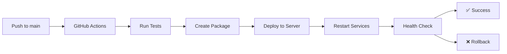

# ESS CI/CD Setup Instructions

This repository uses GitHub Actions for automated deployment to production servers.

## Setup Required

### 1. GitHub Secrets Configuration

Add the following secrets to your GitHub repository (Settings → Secrets and Variables → Actions):

```bash
# Production Server Access
PRODUCTION_SSH_KEY=<private-key-content>
PRODUCTION_USER=uswege

# Admin Server Access  
ADMIN_SSH_KEY=<private-key-content>
ADMIN_USER=uswege
```

### 2. SSH Key Generation

```bash
# Generate SSH key pair for GitHub Actions
ssh-keygen -t ed25519 -C "github-actions@miracore" -f ~/.ssh/github_actions_key

# Copy public key to production servers
ssh-copy-id -i ~/.ssh/github_actions_key.pub uswege@135.181.33.13
ssh-copy-id -i ~/.ssh/github_actions_key.pub uswege@5.75.185.137

# Add private key content to GitHub secrets
cat ~/.ssh/github_actions_key
```

### 3. Manual Deployment

```bash
# Make deployment script executable
chmod +x scripts/deploy-production.sh

# Run manual deployment
./scripts/deploy-production.sh
```

## Workflows

### 1. Production Deployment (`deploy-production.yml`)
- **Trigger**: Push to `main` branch
- **Target**: 135.181.33.13 (ESS Backend)
- **Actions**:
  - Install dependencies
  - Run tests
  - Create deployment package
  - Deploy to production
  - Restart PM2 services
  - Verify health checks

### 2. Admin Portal Deployment (`deploy-admin.yml`)
- **Trigger**: Push to `main` branch (admin-related files)
- **Targets**: 
  - 5.75.185.137 (Admin Portal Frontend)
  - 135.181.33.13 (Admin API Backend)
- **Actions**:
  - Update admin compatibility routes
  - Rebuild React frontend
  - Deploy to web directory
  - Restart services

## Deployment Process



## Manual Commands

```bash
# Check deployment status
ssh uswege@135.181.33.13 "pm2 list && curl http://localhost:3002/health"

# View logs
ssh uswege@135.181.33.13 "pm2 logs ess-app"

# Restart services manually
ssh uswege@135.181.33.13 "cd /home/uswege/ess && pm2 restart all"

# Check admin portal
curl http://5.75.185.137/ | grep "Admin"
curl http://5.75.185.137/api/v1/
```

## Environment Variables

The following environment variables are used in production:

```bash
# Production (.env)
NODE_ENV=production
PORT=3002
MONGODB_URI=mongodb://localhost:27017/miracore

# Admin (.env)
REACT_APP_API_V1_BASE_URL=http://5.75.185.137/api/v1
```

## Rollback Process

If deployment fails:
1. GitHub Actions will automatically trigger rollback
2. Previous backup will be restored
3. Services will be restarted
4. Manual rollback: `./scripts/deploy-production.sh rollback`

## Monitoring

- **Health Endpoint**: http://135.181.33.13:3002/health
- **Admin Portal**: http://5.75.185.137/
- **Grafana**: http://5.75.185.137:3000/
- **PM2 Monitoring**: `pm2 monit`

## Troubleshooting

```bash
# Check GitHub Actions logs
# Go to: Repository → Actions → Latest workflow run

# Check server logs
ssh uswege@135.181.33.13 "tail -f /home/uswege/ess/logs/out.log"

# Check PM2 status
ssh uswege@135.181.33.13 "pm2 status && pm2 logs ess-app --lines 50"

# Restart deployment manually
ssh uswege@135.181.33.13 "cd /home/uswege/ess && npm install && pm2 restart all"
```